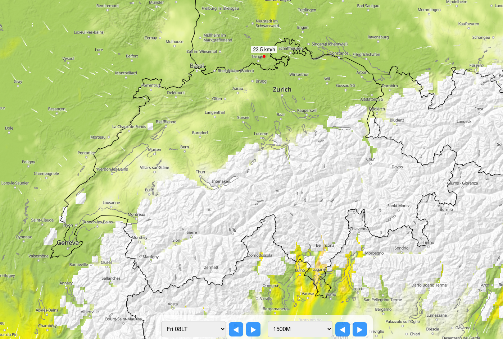

# Low Level Wind
# Created by Oliver Wipfli with Claude and ChatGPT help 

https://www.oliverwipfli.ch/low-level-wind-2025-07-09/

```
docker build -t sma .
docker run --rm -it -v "$(pwd)":/app sma python3 extract.py
```

https://www.lowlevelwind.ch



# WindSpots version

https://station.windspots.org/lowlevelwind.html
